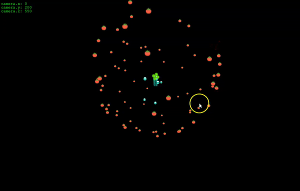

# shooter-tower-3D-phaser-3

This phaser3 demo's code is inspired by this [Phaser-3 example](https://phaser.io/examples/v3/view/camera/3d-camera/dot-sphere)

Phaser3 supports a graphics plugin for *pseudo-3D* effect, it may offer potential for upgrading a shooter 2D-game I am working on.

This demonstrates a space watchtower shooting randomly the orbiting spheres, scroll your mousewheel and let the tower destroy the spheres, zoom in and out with up and down arrows

### feature
 - could not make the animationManager work for me with the Sprite3D, I worked-around it using time.event with setTexture
 - a more advanced goal is to inject some physics for the shooting instead of simply activating explosion effects